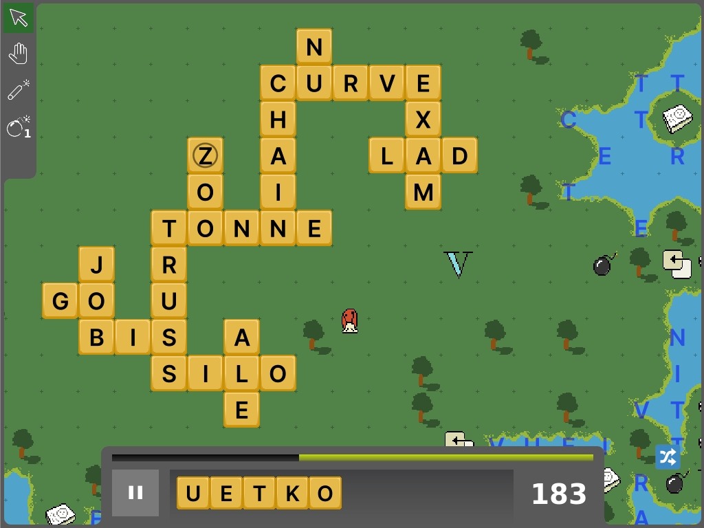

Wordlike
========



This is a prototype of a game idea that is principally a tile-laying
word game (like scrabble, bananagrams, etc.) with some extra mechanics
involving getting bonuses that enable expansion across a large grid.
Some influence coming from roguelikes, tower defense games, etc.

Development
----------

In one shell, you can
```shell
make watch
```
to build the js bundle and in another
```shell
make serve
```
to start a local server on port 8000.

Browse to http://localhost:8000 to play the game.

Directory Structure
-------------------

| Directory | Description |
| --- | --- |
| [public](public) | Static assets for browser version |
| [src](src) | Typescript code of the main body of the game |
| [tests](tests) | Unit tests |
